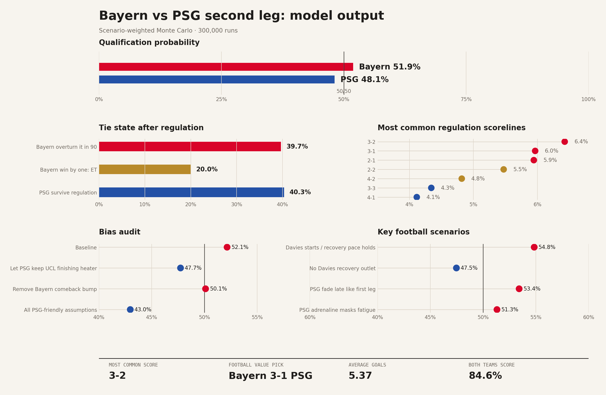

# Bayern vs PSG Second-Leg Simulation

Football data simulation project for the Bayern Munich vs Paris Saint-Germain Champions League semifinal second leg.

The goal is to build a realistic, explainable match simulation that combines public statistical sources with football-specific tactical priors. This is not a black-box prediction model. It is a scenario-weighted Monte Carlo model where every feature should be documented, inspected, and stress-tested.

## Current Model Thesis

PSG lead the tie 5-4 after the first leg. Bayern are at home and likely to press aggressively from the first minute. PSG remain extremely dangerous in transition, but the absence of Achraf Hakimi changes their right-side pace, midfield structure, and counter-launch patterns.

The model currently treats Bayern as a narrow qualification favorite, not because PSG are weak, but because several matchup-specific edges stack together:

- Bayern have the strongest Champions League attacking profile by xG.
- Bayern's front three of Kane, Olise, and Diaz have elite finishing and creation quality.
- PSG are elite finishers, so their xG overperformance is not regressed as pure noise.
- Hakimi's absence removes PSG's most dynamic right-side transition outlet.
- If Warren Zaire-Emery plays right-back, PSG may defend well there but lose midfield dynamism.
- Fabian Ruiz may provide technique, but if off rhythm he can slow PSG's counter-launch phase.
- Bayern's defensive risk is mainly structural: the press deliberately leaves large-space defending moments.
- Davies or equivalent recovery pace matters because it determines how survivable those transition moments become.

## Repository Structure

```text
.
├── README.md
├── docs/
│   ├── assumptions.md
│   ├── feature_dictionary.md
│   ├── methodology.md
│   ├── model_contract.md
│   └── sources.md
├── src/
│   └── simulation_spec.py
├── data/
│   ├── raw/
│   └── processed/
└── notebooks/
```

## Planned Outputs

The simulation should produce:

- 90-minute 1X2 probabilities
- Aggregate qualification probabilities
- Most likely scorelines
- Best football-informed value scoreline
- Extra-time and penalty paths
- Goals, xG, shots, shots on target, and both-teams-to-score projections
- Conditional outputs by scenario:
  - WZE at RB vs alternate PSG shape
  - Davies/recovery pace present vs absent
  - PSG fatigue visible vs masked
  - Neuer strong/normal/bad-tail performance
  - Karl/Bischof bench availability

## Current Result Visual

The repo includes a code-generated LinkedIn-ready visual. It is generated from `outputs/results.json` and can be reproduced with the commands below.



## Quick Start

```bash
python3 src/simulate.py \
  --config configs/bayern_psg.json \
  --output outputs/results.json

python3 src/visual.py \
  --results outputs/results.json \
  --output outputs/linkedin_results.png

python3 src/bias_audit.py \
  --config configs/bayern_psg.json \
  --runs 120000 \
  --output outputs/bias_audit.json \
  --markdown docs/bias_audit.md
```

The current run uses 300,000 simulations with seed `202605021337`.

## Bias Audit

The repo includes an ablation-based bias audit that tests whether Bayern-favorable analyst priors are driving the result. The headline finding: the model does contain Bayern-leaning priors, but the edge is narrow and assumption-sensitive.

See [docs/bias_audit.md](docs/bias_audit.md).

## Design Principles

- Keep sourced data separate from analyst priors.
- Use probabilities, not certainties.
- Model tactical mechanisms, not just team names.
- Prefer scenario weights over one brittle lineup assumption.
- Clearly label subjective priors.
- Stress-test important assumptions.

## Status

Documentation, reproducible simulation code, result JSON, and a code-generated LinkedIn visual are included. The next step is to harden the model with refreshed pre-match lineup news and referee data close to kickoff.
